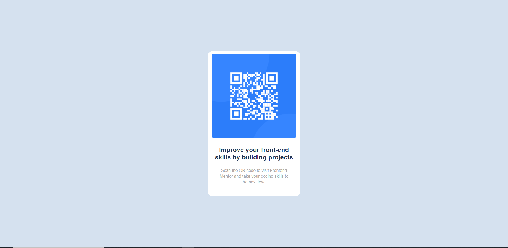

# Frontend Mentor - QR code component solution

This is a solution to the [QR code component challenge on Frontend Mentor](https://www.frontendmentor.io/challenges/qr-code-component-iux_sIO_H). Frontend Mentor challenges help you improve your coding skills by building realistic projects. 

## Table of contents

- [Overview](#overview)
  - [Screenshot](#screenshot)
  - [Links](#links)
- [My process](#my-process)
  - [Built with](#built-with)
  - [What I learned](#what-i-learned)
  - [Continued development](#continued-development)
  - [Useful resources](#useful-resources)
- [Author](#author)
- [Acknowledgments](#acknowledgments)

## Overview

### Screenshot of Deesktop & Mobile view

### Links

- Solution URL: [Github](https://github.com/Priyanshi233/QR-Code-Component/tree/master)
- Live Site URL: [Netlify](https://superb-brioche-4d79f0.netlify.app/)

## My process

### Built with

- Semantic HTML5 markup
- CSS custom properties
- [Styled Components](https://styled-components.com/) - For styles

### What I learned

It was a good practice for brushing up my HTML & CSS Skills.
### Continued development

I will continue to work on many frontend projects.
### Useful resources

Thanks to the google

## Author
- Website - [Priyanshi Somani](https://github.com/Priyanshi233)
- Frontend Mentor - [@Priyanshii677](https://www.frontendmentor.io/profile/Priyanshii677)
## Acknowledgments

Thanks to the google